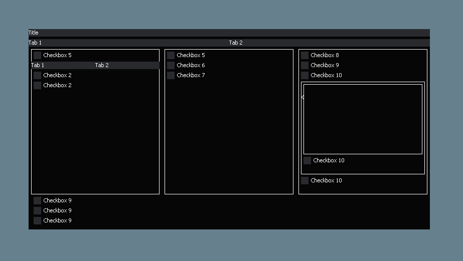

# bad-ui
This was made as an alternative to imgui, nuklear, fgui that is minimal and doesn't contain bloat like these other ones do.  
This works with all renders including:
- directx9
- directx11
- opengl
- vulkan
- anything that can draw a line and render text

  

